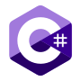

<h1 align="left">Yo! I'm mg0x7BE</h1>

###

I'm not a coder or a tech wizard or anything like that. I just dig computers and find them a cool way to kill time.

###

<h2 align="left">Tech that gets me hyped:</h2>

###

###

If you're curious and want to know more, hit up my homepage or stalk me on social media.

###

  
  

###
